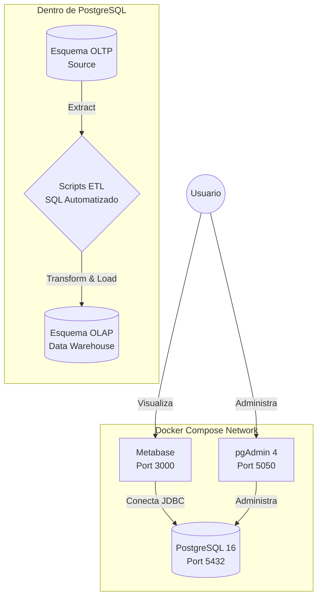
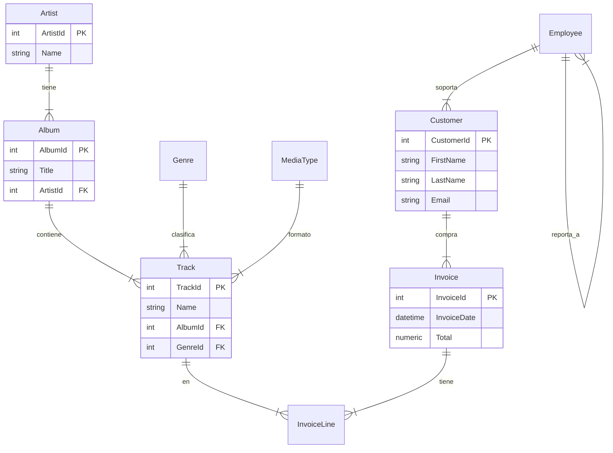
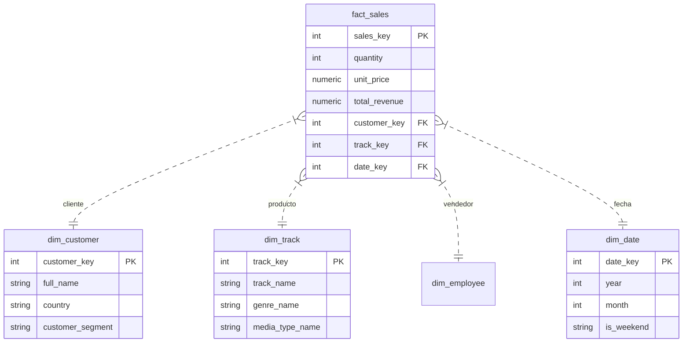

# 📊 Chinook Strategy Command Center

> Solución integral de Business Intelligence end-to-end: Data Warehouse, ETL automatizado y visualización interactiva para análisis estratégico de datos de negocio.

 
 
 


## 📑 Tabla de Contenidos

- [Descripción General](#-descripción-general)
- [Características Principales](#-características-principales)
- [Arquitectura del Sistema](#-arquitectura-del-sistema)
- [Modelo de Datos](#-modelo-de-datos)
  - [Esquema OLTP (Fuente)](#esquema-oltp-fuente)
  - [Esquema OLAP (Data Warehouse)](#esquema-olap-data-warehouse)
- [Análisis Implementados](#-análisis-implementados)
  - [Segmentación RFM](#segmentación-rfm-de-clientes)
  - [KPIs de Negocio](#kpis-de-negocio)
- [Instalación y Configuración](#-instalación-y-configuración)
  - [Requisitos Previos](#requisitos-previos)
  - [Pasos de Instalación](#pasos-de-instalación)
  - [Acceso a Servicios](#acceso-a-servicios)
- [Estructura del Proyecto](#-estructura-del-proyecto)
- [Stack Tecnológico](#-stack-tecnológico)
- [Uso y Operación](#-uso-y-operación)
- [Troubleshooting](#-troubleshooting)
- [Contribución](#-contribución)
- [Licencia](#-licencia)
- [Autor](#-autor)

## 🎯 Descripción General

**Chinook Strategy Command Center** es un proyecto de análisis de datos que implementa una solución completa de **Business Intelligence (BI)** para transformar datos transaccionales en insights accionables. El proyecto simula un entorno corporativo real de una tienda de medios digitales, abarcando desde la extracción de datos hasta la visualización interactiva de métricas de negocio.

### Contexto de Negocio

**Chinook** es una tienda global de música y video digital con operaciones en múltiples países. A pesar de contar con un sistema transaccional robusto, la organización enfrentaba desafíos críticos:

- **Silos de información**: Datos dispersos en tablas normalizadas sin visión consolidada.
- **Latencia analítica**: Consultas complejas degradaban el rendimiento operacional.
- **Ausencia de segmentación**: Sin metodología para identificar clientes de alto valor o en riesgo de churn.
- **Decisiones reactivas**: Falta de métricas en tiempo real para estrategia comercial.

### Solución Implementada

Este proyecto resuelve estos desafíos mediante:

1. **Migración OLTP → OLAP**: Construcción de un Data Warehouse optimizado para análisis.
2. **Pipeline ETL automatizado**: Transformación y carga de datos sin intervención manual al iniciar el contenedor.
3. **Modelo dimensional**: Esquema de estrella (Star Schema) para consultas de alto rendimiento.
4. **Segmentación avanzada**: Algoritmo RFM para clasificación de clientes directamente en SQL.
5. **Dashboard interactivo**: Visualización en tiempo real con Metabase pre-cargado.
6. **Infraestructura como código**: Despliegue reproducible "One-Click" con Docker Compose.

## ✨ Características Principales

- ✅ **Despliegue automatizado**: Un solo comando (`docker compose up`) levanta toda la infraestructura.
- ✅ **ETL sin código**: Scripts SQL ejecutados automáticamente al iniciar.
- ✅ **Pre-configurado**: Dashboard con visualizaciones y conexiones listas para usar.
- ✅ **Análisis avanzado**: Segmentación RFM, análisis de cohortes, series temporales.
- ✅ **Escalable**: Arquitectura modular basada en microservicios.
- ✅ **Portable**: Funciona en cualquier sistema (Windows, Mac, Linux) con Docker.
- ✅ **Open Source**: Stack tecnológico completamente libre y gratuito.

## 🏗️ Arquitectura del Sistema

El proyecto implementa una arquitectura de datos moderna basada en contenedores, siguiendo el patrón **ELT (Extract, Load, Transform)**.

### Diagrama de Arquitectura



### Componentes

#### 1. Base de Datos PostgreSQL (Contenedor `db`)

* **Imagen**: `postgres:16`
* **Función**: Aloja tanto el esquema OLTP (fuente) como el OLAP (Data Warehouse) en la base de datos `chinook`.
* **Inicialización**: Ejecuta automáticamente scripts SQL en `/docker-entrypoint-initdb.d/`:
* `01_oltp.sql`: Crea y puebla el esquema transaccional.
* `02_olap.sql`: Crea el esquema dimensional `analytics` y ejecuta transformaciones ETL.


* **Persistencia**: Volumen Docker `postgres_data` para garantizar durabilidad.

#### 2. Metabase (Contenedor `metabase`)

* **Imagen**: `metabase/metabase:latest`
* **Función**: Plataforma de BI para visualización interactiva.
* **Configuración**: Base de datos H2 embebida restaurada desde backup local.
* **Conectividad**: Se conecta automáticamente al esquema OLAP del contenedor `db`.

#### 3. pgAdmin (Contenedor `pgadmin`)

* **Imagen**: `dpage/pgadmin4:latest`
* **Función**: Interfaz web para administración de PostgreSQL.
* **Uso**: Inspección de esquemas, ejecución de queries, debugging.

## 📐 Modelo de Datos

### Esquema OLTP (Fuente)

El esquema transaccional sigue la **Tercera Forma Normal (3NF)**, optimizado para integridad referencial y operaciones CRUD.

#### Diagrama OLTP



**Limitaciones del modelo OLTP para análisis**:

* Requiere 6+ JOINs para consultas analíticas básicas.
* Alto costo computacional para agregaciones.
* Diseñado para escritura (INSERT/UPDATE), no para lectura intensiva.

### Esquema OLAP (Data Warehouse)

El Data Warehouse implementa un **Star Schema** optimizado para consultas analíticas de alto rendimiento, alojado en el esquema `analytics`.

#### Diagrama OLAP



**Ventajas del modelo OLAP**:

* **Reducción de JOINs**: De 6+ a 1-2 uniones máximo.
* **Performance**: Consultas drásticamente más rápidas.
* **Desnormalización estratégica**: Datos redundantes para acelerar lectura.

## 📊 Análisis Implementados

### Segmentación RFM de Clientes

El proyecto implementa un algoritmo de **RFM (Recency, Frequency, Monetary)** directamente en SQL mediante Window Functions (`NTILE`).

**Lógica de Segmentación**:

1. **Recencia (R)**: Días desde la última compra.
2. **Frecuencia (F)**: Cantidad de facturas únicas.
3. **Monetización (M)**: Total gastado histórico.

| Segmento | Descripción | Estrategia Sugerida |
| --- | --- | --- |
| 🥇 **Campeones (VIP)** | Score RFM alto (R=5, F=5, M=5) | Programas de fidelidad exclusivos. |
| 💎 **Leales Potenciales** | Compran seguido, buen gasto | Upselling y Cross-selling. |
| ⚠️ **En Riesgo** | Gastaban mucho pero no volvieron | Campañas de reactivación agresivas. |
| 💤 **Perdidos** | Baja frecuencia y recencia | Evaluar costo de retención vs adquisición. |

### KPIs de Negocio

El dashboard implementa los siguientes indicadores clave:

#### KPIs Financieros

| Métrica | Definición |
| --- | --- |
| **Total Revenue** | Suma total de facturación histórica. |
| **AOV (Ticket Promedio)** | Ingreso promedio por transacción única. |

#### KPIs Operativos

| Métrica | Definición |
| --- | --- |
| **Top Géneros** | Géneros musicales con mayor volumen de ventas. |
| **Top Países** | Regiones geográficas con mayor penetración de mercado. |
| **Performance Empleados** | Ranking de ventas por agente de soporte. |

## 🚀 Instalación y Configuración

### Requisitos Previos

Antes de comenzar, asegúrese de tener instalado:

* **Docker**: v20.10 o superior.
* **Docker Compose**: v2.0 o superior (incluido en Docker Desktop).
* **Git**: Para clonar el repositorio.
* **Puertos Libres**: 3000 (Metabase), 5432 (Postgres), 5050 (pgAdmin).

### Pasos de Instalación

#### 1. Clonar el Repositorio

```bash
git clone https://github.com/tu-usuario/devlights-data-analysis-final-project.git
cd devlights-data-analysis-final-project
```

#### 2. Levantar la Infraestructura

Ejecute el siguiente comando en la raíz del proyecto:

```bash
docker compose up -d
```

**¿Qué sucede al ejecutar esto?**

1. Descarga las imágenes de Postgres, Metabase y pgAdmin.
2. Crea la red `chinook_net`.
3. Inicia la base de datos `chinook`.
4. Ejecuta `01_oltp.sql` (Crea tablas fuente).
5. Ejecuta `02_olap.sql` (Crea DW y procesa datos).
6. Inicia Metabase y restaura el dashboard desde el backup local.

> ⏳ **Nota**: El primer inicio puede demorar unos 60 segundos mientras se inicializan los servicios.

#### 3. Verificar Estado

```bash
docker compose ps
```

Todos los contenedores (`chinook_db`, `chinook_bi`, `chinook_pgadmin`) deberían estar en estado "Up" o "Running".

### Acceso a Servicios

#### 📊 A. Dashboard de Negocio (Metabase)

El sistema ya viene con usuarios y dashboards precargados.

* **URL**: [http://localhost:3000](https://www.google.com/search?q=http://localhost:3000)
* **Email**: `admin@devlights.com`
* **Password**: `helloworld2025`

#### 🛠️ B. Administración de Base de Datos (pgAdmin 4)

Para inspección técnica y consultas SQL manuales.

* **URL**: [http://localhost:5050](https://www.google.com/search?q=http://localhost:5050)
* **Email**: `admin@chinook.com`
* **Password**: `root`

**Datos para conectar el servidor (Register Server):**

* **Host name**: `db`
* **Username**: `devlights_user`
* **Password**: `devlights_password`
* **Database**: `chinook`

## 📁 Estructura del Proyecto

```
devlights-data-analysis-final-project/
│
├── docker-compose.yml          # Orquestación de contenedores
│
├── assets/                     # Scripts SQL de inicialización
│   ├── 01_oltp.sql             # Script Fuente (OLTP)
│   └── 02_olap.sql             # Script Data Warehouse (OLAP + ETL)
│
├── metabase_backup_data/       # Backup persistente del Dashboard
│   └── metabase.db.mv.db       # Base de datos H2 de Metabase
│
└── README.md                   # Documentación del proyecto
```

## 🛠️ Stack Tecnológico

| Componente | Tecnología | Versión | Uso |
| --- | --- | --- | --- |
| **Base de Datos** | PostgreSQL | 16 | Motor Relacional & Data Warehouse |
| **Contenedores** | Docker | Latest | Empaquetado y ejecución |
| **Orquestación** | Docker Compose | v2+ | Gestión de servicios y redes |
| **Visualización** | Metabase | Latest | Dashboarding y BI |
| **Administración** | pgAdmin 4 | Latest | GUI para PostgreSQL |
| **Lenguaje** | SQL (PL/pgSQL) | Standard | Lógica de negocio y transformación |

## 💡 Uso y Operación

### Comandos Útiles

**Detener el entorno (conservando datos):**

```bash
docker compose stop
```

**Reiniciar el entorno:**

```bash
docker compose start
```

**Destruir entorno (BORRA DATOS y volúmenes):**

```bash
docker compose down -v
```

*⚠️ Útil si quieres reiniciar la base de datos desde cero para volver a correr los scripts SQL.*

**Ver logs de la base de datos:**

```bash
docker logs -f chinook_db

```

---

## 🔧 Troubleshooting

### Problema: "Container chinook_db is unhealthy"

* **Causa**: El script SQL falló o tardó demasiado.
* **Solución**: Revisa los logs con `docker logs chinook_db`. Si hubo un error en los scripts, corrige el SQL y ejecuta `docker compose down -v` seguido de `docker compose up -d`.

### Problema: Metabase pide configuración inicial (Setup)

* **Causa**: No leyó correctamente el archivo de backup.
* **Solución**: Asegúrate de que la carpeta `metabase_backup_data` contenga el archivo `metabase.db.mv.db` directamente (sin subcarpetas extra) y reinicia el contenedor `chinook_bi`.

### Problema: Puerto ocupado (Bind for 0.0.0.0:3000 failed)

* **Causa**: Otro servicio en tu PC usa el puerto 3000.
* **Solución**: Edita `docker-compose.yml` y cambia el mapeo de puertos de Metabase a `"3001:3000"`.

## 🤝 Contribución

Las contribuciones son bienvenidas. Para cambios importantes:

1. Fork el repositorio.
2. Crea una rama (`git checkout -b feature/AmazingFeature`).
3. Commit tus cambios (`git commit -m 'Add some AmazingFeature'`).
4. Push a la rama (`git push origin feature/AmazingFeature`).
5. Abre un Pull Request.

## 📄 Licencia

Este proyecto está bajo la Licencia MIT. Ver archivo `LICENSE` para más detalles.

## 👤 Autor

**Facundo Nicolás González**

* **Proyecto**: Trabajo final Data Analytics - Devlights
* **GitHub**: [@titesen](https://github.com/titesen)
* **LinkedIn**: [Facundo González](https://www.linkedin.com/in/facundo-n-gonzalez/)

---

*Última actualización: Diciembre 2025*